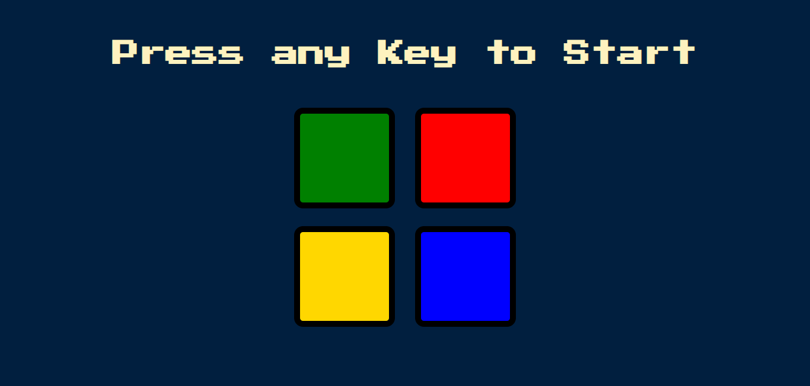

# Simon Game Website

Welcome to the Simon Game Website! This project is an interactive implementation of the classic memory game "Simon," where players test their memory and pattern recognition skills.

## Table of Contents
- [Introduction](#introduction)
- [Demo](#demo)
- [Features](#features)
- [Technologies Used](#technologies-used)
- [Installation](#installation)
- [Usage](#usage)

## Introduction
The Simon Game Website provides a digital version of the popular Simon game. The game consists of a series of buttons that light up in a specific pattern. The player must repeat the pattern correctly to advance to the next round. With each successful round, the pattern becomes longer and more challenging.

## Demo
Check out the live demo of the Simon Game Website: [Simon Game Demo](https://sahermuhamed.github.io/simon-game-website/)

## Features
- Interactive buttons with sounds and animations.
- Progressive difficulty levels as the player advances.
- Strict mode for a more challenging experience.
- Clear user interface indicating the current pattern and user's progress.

## Technologies Used
- HTML5
- CSS3
- JavaScript
- jQuery

## Usage
1. Press any keyboard key to start the game.
2. Watch the pattern of buttons that light up and listen to their sounds.
3. Repeat the pattern by clicking the buttons in the same order.
4. If you make a mistake and are not in strict mode, the pattern will be repeated for you. In strict mode, the game restarts.
5. As you progress, the patterns become longer and more challenging.
6. The game continues until you either win by completing all the levels or make a mistake in strict mode.
